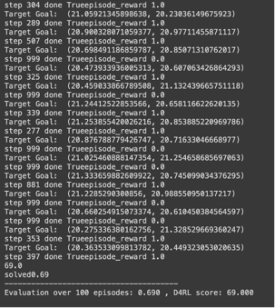

# IQL AntMaze report
Monday 13 Aug 2024

Report + Colab (iql_antmaze.ipynb) with code (training process and Experiments for AntMaze task + IQL)

Report contains two main parts:
* Part I: Algorithm and Task description
* Part II: Colab Experiments and Results

Part I. Algo and Task description
------------------------------------------------------------------------------------------------------------------------
Offline RL is concerned with finding a policy that improves over the behavior policies
that collected the data. To counterbalance the effect of extrapolation error,
most works add a constraint to stay close to behavior policies while improving over it as
well as avoiding distribution shifts.

The  operation in the bootstrapping of the TD-target as well as in the policy extraction step
is susceptible to extrapolation errors. Such errors occur when the critic is not truthful for
actions far from the data in the buffer. While in online RL the agent can collect additional
experience and correct itself (optimism is even probably efficient), this is not an option in
the offline RL setting, because agent can't collect more data and fix this overestimation.
Thus, a core challenge is offline RL is avoiding the occurrence or
mitigating the impact of extrapolation errors. Bootstrapping, coupled with the maximization
over the action space, carries a high risk of selecting actions that are not within the
support of the dataset.

### IQL details:
* [IQL paper](https://arxiv.org/abs/2110.06169) [Submitted on 12 Oct 2021] Authors: I. Kostrikov, A. Nair, S. Levine

* [IQL blog post](https://transferlab.ai/pills/2023/implicit-q-learning/) with some useful comments about ideas and implementation

The technical core contribution of the paper is to use expectile regression within the policy
evaluation step.
The [expectile](https://medium.com/@joachimiak.krzysztof/expectile-regression-an-alternative-for-quantile-regression-48298fb6eaa0) is a generalization of the mean and the expectile loss is a generalization
of the MSE (mean squared error) when quantile is generalisation over MAE (mean absolute error)

IQL improvements:
1) Predicting an upper expectile of the TD-target approximates the maximum of over actions
constrained to the <b>dataset</b> actions - this part tries to minimize distribution shift over actions.

2) The second issue in the expectiles being estimated with respect to both, states and actions. Even so only
actions in the support of the data are considered, the objective also incorporates stochasticity that comes from
the environment dynamics. Large target value might not necessarily reflect the existence of a single action that
achieves that value but rather a “fortunate” sample transitioning into a good state. The proposed solution is to introduce a separate
value function  approximating an expectile purely with respect to the action distribution. This leads to the final
training objective for the value function (see IQL blog post).

### AntMaze task details:
The three maze layouts are shown below (from left to right: open, <b>medium</b>, large):
(Medium (the second) was used in this report)

* [Gymnasium AntMaze description](https://gymnasium.farama.org/environments/mujoco/ant/)

* [d4rl AntMaze info](https://github.com/Farama-Foundation/d4rl/wiki/Tasks)

Task solved using d4rl antmaze-medium-play-v2 dataset.

Dataset contains 999000 samples with hand crufted goal position for ant.

Goal is to train Ant to get position near the target which represented as x,y coordinates.

Environments and task details:

| Item                | Type | Comment |
| :----------------   | :------: | ----: |
| Action Space        |   Box(-1.0, 1.0, (8,), float32)   | 8 actions applied to hinge joints via ant legs |
| Observation Space   |    Box(-inf, inf, (29,), float64)| 27 for ant position +2 for goal |
| Reward              | int 0 or 1|Sparse reward 0 if goal is not achieved (length of ant is more than 0.5 meters to the goal) and 1 else |
| max episode length  | int |Default value 1000 steps |

Part II. Colab Experiments and Results
------------------------------------------------------------------------------------------------------------------------
Possible issues during run this Colab:
1. Nvidia drivers to run on GPU (I used CPU, - enough for this task), gpu raised some more errors;
2. Wandb login access, you must have account;
3. Connect to Drive to save/load models, create and load trained model to repeat results without training
(you should have folder `iql_report` in MyDrive);
4. Sometimes Session in Colab resets and you should rerun cells and/or even the whole Session and init all
cells one more time. 
5. Add model to the google drive and specify path to it as params in IQL to use this model for evaluation (by default
last cell contains correct set up, you just need to put model to drive and connect to it)

### Experiment results
1) IQL implementation+parameters from CORL for <b>antmaze-medium-play</b> were taken
2) Training in colab was conducted ([Colab](https://colab.research.google.com/drive/1Ae-tNWr3WuYkNKhpG9w-VtaohYf2302G?usp=sharing));
3) Colab contains dependencies installations (d4rl+mojuco_py(for antmaze)+wandb) (took enough time to set up it correctly)
4) Training part ([wandb runs report](https://api.wandb.ai/links/rl_group/7kwfc9y4)) of offline RL algo in Collab cpu was made (300k steps approximately takes 3-4 hours each run)
5) Algorithm converged (reward and losses on the plato)
6) During training process pytorch model (Gaussian Policy for 8 actions for ant) was saved (each 5k training steps)
(one of best model which get the most reward is added to this project (checkpoint_149999.pt). This model can be used
to repeat evaluation process.
7) In the end Model was loaded for evaluation of the test process. Ant is able to reach
about 69 (reward value) times out of 100 episode runs, what is close to presented in paper results.
8) Evaluations of the process was a bit improved what helps better to interpretate the results of Ant behaviour.

Colab and one Pytorch model are presented inside this project report what allows to repeat the process described above.

Example of Evaluations results you can see on the picture below:
step 999 means IQL agent didn't achieve goal till the end of episode, else he got his target.

